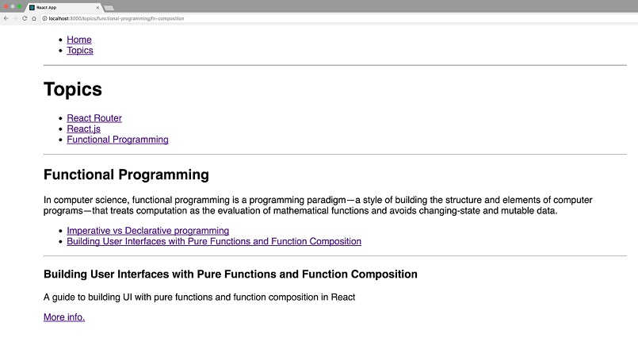

# React Router | 02

## Nested routes with React Router

In order to understand recursion, you first need to be familiar with functions,
return values, and the callstack. Similar, in order to understand nested
routes, you first need to be comfortable with React Router's most fundamental
component, `<Route>`.

`<Route>` takes in a path and a component. _When your app's current location
matches the path, the component will be rendered_. When it doesn't, `Route`
will render null.

The way I like to think is whenever you use
`<Route path='/path' component={X} />`, it's always going to render something.
If the app's location matches the path, it'll render the component. If it
doesn't, it will render `null`.

>    I realize we're starting off slow here but if you fully grasp that last
paragraph, the rest of this tutorial will be nice.

With that out of the way, let's take a look at the example we'll building.
The idea is we have a list of topics, those topics have resources, and those
resources have a url. Here's the data structure we're working with.

```
const topics = [
  {
    name: 'React Router',
    id: 'react-router',
    description: 'Declarative, component based routing for React',
    resources: [
      {
        name: 'URL Parameters',
        id: 'url-parameters',
        description: "URL parameters are parameters whose values are set dynamically in a page's URL. This allows a route to render the same component while passing that component the dynamic portion of the URL so it can change based off of it.",
        url: 'https://tylermcginnis.com/react-router-url-parameters'
      },
      {
        name: 'Programatically navigate',
        id: 'programmatically-navigate',
        description: "When building an app with React Router, eventually you'll run into the question of navigating programmatically. The goal of this post is to break down the correct approaches to programmatically navigating with React Router.",
        url: 'https://tylermcginnis.com/react-router-programmatically-navigate/'
      }
    ]
  },
  {
    name: 'React.js',
    id: 'reactjs',
    description: 'A JavaScript library for building user interfaces',
    resources: [
      {
        name: 'React Lifecycle Events',
        id: 'react-lifecycle',
        description: "React Lifecycle events allow you to tie into specific phases of a component's life cycle",
        url: 'https://tylermcginnis.com/an-introduction-to-life-cycle-events-in-react-js/'
      },
      {
        name: 'React AHA Moments',
        id: 'react-aha',
        description: "A collection of 'Aha' moments while learning React.",
        url: 'https://tylermcginnis.com/react-aha-moments/'
      }
    ]
  },
  {
    name: 'Functional Programming',
    id: 'functional-programming',
    description: 'In computer science, functional programming is a programming paradigm—a style of building the structure and elements of computer programs—that treats computation as the evaluation of mathematical functions and avoids changing-state and mutable data.',
    resources: [
      {
        name: 'Imperative vs Declarative programming',
        id: 'imperative-declarative',
        description: 'A guide to understanding the difference between Imperative and Declarative programming.',
        url: 'https://tylermcginnis.com/imperative-vs-declarative-programming/'
      },
      {
        name: 'Building User Interfaces with Pure Functions and Function Composition',
        id: 'fn-composition',
        description: 'A guide to building UI with pure functions and function composition in React',
        url: 'https://tylermcginnis.com/building-user-interfaces-with-pure-functions-and-function-composition-in-react-js/'
      }
    ]
  }
]
```

This schema will map nicely to nested routes and our app will eventually
end up looking like this:



Before we start worrying about nested routes, let's first create the skeleton
of our app including the navbar which will allow us to navigate between
`widget.jsjs` (`/`) and `Topics` (`/topics`).

```
import React, { Component } from 'react'
import {
  BrowserRouter as Router,
  Link,
  Route // for later
} from 'react-router-dom'

class App extends Component {
  render() {
    return (
      <Router>
        <div style={{width: 1000, margin: '0 auto'}}>
          <ul>
            <li><Link to='/'>Home</Link></li>
            <li><Link to='/topics'>Topics</Link></li>
          </ul>
        </div>
      </Router>
    )
  }
}

export default App
```

That's a solid start. Now what we want to do is render a few `<Route>`s so
that the UI will change based on the current path we're on. However, before
we can do that, we need to go ahead and build out the components that we'll
pass to our `<Route>`s to render if there's a match. - we'll call them `widget.jsjs`
and `Topics`. For now, while we get things set up, let's just have both of
them render a header which says either `HOME` or `TOPICS`.

```
function Home () {
   return (
     <h1>
       HOME
     </h1>
   )
 }

 function Topics () {
   return (
     <h1>
       TOPICS
     </h1>
   )
 }
```

Perfect. Now, we'll use the <Route> component to tell React Router that whenever
someone is on `/`, it should render the widget.jsjs component and whenever someone
is on `/topics`, it should render the `Topics` component.

If we're at /, we'll see the navbar and the widget.jsjs component. If we're at `/topics`,
we'll see the navbar and the `Topics` component.

Finally we have a good enough fountaion to start talking about how we go
about dealing with nested routes with React Router. Thanks for your patience.

If you look back to the final example, you'll notice that when we go to `/topics`,
the UI we get is another navbar. Let's modify our Topics component to do
just that. This time instead of hard coding our Links, we'll need to use
our topics array to create a Link for each high level topic.

```
function Topics () {
  return (
    <div>
      <h1>Topics</h1>
      <ul>
        {topics.map(({ name, id }) => (
          <li key={id}>
            <Link to={`/topics/${id}`}>{name}</Link>
          </li>
        ))}
      </ul>
    </div>
  )
}
```

Now, when we go to `/topics` and the `Topics` component is rendered, we'll
get three Links each representing a high level topic. Notice where we're
linking to, `/topics/${id}`. If we're going to link someone to `/topics/${id}`,
that means we need to render a Route which is going to match at that path.
This is the first big concept of nested routes with React Router - it doesn't
matter if you render a Route in your main component or in nested components,
if the path matches, the component will be rendered. With that in mind, what
if we render a Route inside of our Topics component and have it match for
`/topics/:topicId?`

```
function Topic () {
  return (
    <div>
      TOPIC
    </div>
  )
}

function Topics () {
  return (
    <div>
      <h1>Topics</h1>
      <ul>
        {topics.map(({ name, id }) => (
          <li key={id}>
            <Link to={`/topics/${id}`}>{name}</Link>
          </li>
        ))}
      </ul>

      <hr />

      <Route path={`/topics/:topicId`} component={Topic}/>
    </div>
  )
}
```

This is why understanding Route was so important. Nothing has changed from
earlier to right now, but for some reason, your brain gets all worked up
since we're rendering a Route outside of our main Widget component.

What's going on is when we go to `/topics`, the `Topic` component is rendered.
Topics then renders a navbar and a new Route which will match for any of
the Links in the navbar we just rendered (since the Links are linking to
`/topics/${id}` and the Route is matching for `/topics/:topicId`). This means
that if we click on any of the Links in the Topics component, the Topic
component is going to be rendered which right now just says that word Topic.

>    It's important to note that just because we matched another `Route` component,
that doesn't mean the previous Routes that matched aren't still rendered.
This is what confuses a lot of people. Remember, think of `Route` as rendering
another component or null. The same way you think of nesting normal components
in React can apply directly to nesting Routes.

At this point we're progressing along nicely. What if, for some reason,
another member of your team who wasn't familiar with React Router decided
to change `/topics` to `/concepts?` They'd probably head over to the main Widget
component and change the Route

```
// <Route path='/topics' component={Topics} />
<Route path='/concepts' component={Topics} />
```

NBD. The problem is, this _totally breaks the app_. Inside of the Topics component
we're assuming that the path begins with `/topics` but now it's been changed
to `/concepts`. What we need is a way for the `Topics` component to receive whatever
the initial path as a prop. That way, regardless of if someone changes the
parent Route, it'll always just work. Good news for us is React Router does
exactly this. Each time a component is rendered with React Router, that component
is passed three props - **`location`**, **`match`**, and **`history`**. The one we care about is match.
match is going to contain information about how the Route was matches (exactly what we need).
Specifically, it has two properties we need, path and url. These are very similar,
this is how the docs describe them -

`path` - The path pattern used to match. Useful for building nested `<Route>`s

`url` - The matched portion of the URL. Useful for building nested `<Link>`s

There's one important insight in those definitions. Use `match.path` for building
nested Routes and use `match.url` for building nested Links.

The best way to answer "why" is to look at an example.

>    If you're not familiar with URL Parameters, head over to React Router
v4: URL Parameters before continuing.

Assume we were using an app that had nested route's and the current URL was
`/topics/react-router/url-parameters`.

If we were to log `match.path`  and `match.url` in the most nested component,
here's what we would get.

```
render() {
  const { match } = this.props // coming from React Router.

  console.log(match.path) // /topics/:topicId/:subId

  console.log(match.url) // /topics/react-router/url-parameters

  return ...
}
```

Notice that path is including the URL parameters and url is just the full
URL. This is why one is used for Links and the other used for Routes.

When you're creating a nested link, you don't want to use URL paramters.
You want the user to literally go to `/topics/react-router/url-parameters`.
That's why match.url is better for nested `Links`. However, when you're matching
certain patters with `Route`, you want to include the URL parameters - that's
why `match.path` is used for nested `Routes`.

Let's head back to our example, as of right now, we're hard coding `/topics`
into our Route and `Links`.

```
function Topics () {
  return (
    <div>
      <h1>Topics</h1>
      <ul>
        {topics.map(({ name, id }) => (
          <li key={id}>
            <Link to={`/topics/${id}`}>{name}</Link>
          </li>
        ))}
      </ul>

      <hr />

      <Route path={`/topics/:topicId`} component={Topic}/>
    </div>
  )
}
```

But as we just talked about, because Topics is rendered by React Router,
it's given a match prop we can use. We'll replace the `/topics` portion of
our **Link** with `match.url` and the `/topics` portion of our Route with `match.path`.

```
unction Topics ({ match }) {
  return (
    <div>
      <h1>Topics</h1>
      <ul>
        {topics.map(({ name, id }) => (
          <li key={id}>
            <Link to={`${match.url}/${id}`}>{name}</Link>
          </li>
        ))}
      </ul>

      <hr />

      <Route path={`${match.path}/:topicId`} component={Topic}/>
    </div>
  )
}
```

At this point our app is about half way done. We still need to add a few more
layers of nesting. Here's the good news - there's nothing more you're going
to learn in this tutorial. Everything we need to do to finish out the remaining
nested routes we've already talked about. We'll continue to create new nested
navbars, continue to render `Routes` and we'll continue to use `match.url` and
`match.path`. If you're comfortable at this point, the rest is gravy.

Now just as we initially did with the `Topics` component, we want to make
it so `Topic` (no s) will also render a nested navbar and a `Route`. The only
difference is now we're one level deeper so we'll map over the topic's
resources for our `Links` and we'll our `Route` will match `/topics/:topicId/subId`.

```
function Resource () {
  return RESOURCE
}

function Topic ({ match }) {
  const topic = topics.find(({ id }) => id === match.params.topicId)

  return (
    <div>
      <h2>{topic.name}</h2>
      <p>{topic.description}</p>

      <ul>
        {topic.resources.map((sub) => (
          <li key={sub.id}>
            <Link to={`${match.url}/${sub.id}`}>{sub.name}</Link>
          </li>
        ))}
      </ul>

      <hr />

      <Route path={`${match.path}/:subId`} component={Resource} />
    </div>
  )
}
```

Finally the last thing we need to do it finish out our Resource component.
Because this is the last child component, we'll no longer be rendering any
more `Links` or `Routes`. Instead, we'll just give it a basic UI including the
name of the resource, the description, and a (normal) link.

```
function Resource ({ match }) {
  const topic = topics.find(({ id }) => id === match.params.topicId)
    .resources.find(({ id }) => id === match.params.subId)

  return (
    <div>
      <h3>{topic.name}</h3>
      <p>{topic.description}</p>
      <a href={topic.url}>More info.</a>
    </div>
  )
}
```

Here's the full code.

```
import React, { Component } from 'react'
import {
  BrowserRouter as Router,
  Route,
  Link,
} from 'react-router-dom'

const topics = [
  {
    name: 'React Router',
    id: 'react-router',
    description: 'Declarative, component based routing for React',
    resources: [
      {
        name: 'URL Parameters',
        id: 'url-parameters',
        description: "URL parameters are parameters whose values are set dynamically in a page's URL. This allows a route to render the same component while passing that component the dynamic portion of the URL so it can change based off of it.",
        url: 'https://tylermcginnis.com/react-router-url-parameters'
      },
      {
        name: 'Programatically navigate',
        id: 'programmatically-navigate',
        description: "When building an app with React Router, eventually you'll run into the question of navigating programmatically. The goal of this post is to break down the correct approaches to programmatically navigating with React Router.",
        url: 'https://tylermcginnis.com/react-router-programmatically-navigate/'
      }
    ]
  },
  {
    name: 'React.js',
    id: 'reactjs',
    description: 'A JavaScript library for building user interfaces',
    resources: [
      {
        name: 'React Lifecycle Events',
        id: 'react-lifecycle',
        description: "React Lifecycle events allow you to tie into specific phases of a components lifecycle",
        url: 'https://tylermcginnis.com/an-introduction-to-life-cycle-events-in-react-js/'
      },
      {
        name: 'React AHA Moments',
        id: 'react-aha',
        description: "A collection of 'Aha' moments while learning React.",
        url: 'https://tylermcginnis.com/react-aha-moments/'
      }
    ]
  },
  {
    name: 'Functional Programming',
    id: 'functional-programming',
    description: 'In computer science, functional programming is a programming paradigm—a style of building the structure and elements of computer programs—that treats computation as the evaluation of mathematical functions and avoids changing-state and mutable data.',
    resources: [
      {
        name: 'Imperative vs Declarative programming',
        id: 'imperative-declarative',
        description: 'A guide to understanding the difference between Imperative and Declarative programming.',
        url: 'https://tylermcginnis.com/imperative-vs-declarative-programming/'
      },
      {
        name: 'Building User Interfaces with Pure Functions and Function Composition',
        id: 'fn-composition',
        description: 'A guide to building UI with pure functions and function composition in React',
        url: 'https://tylermcginnis.com/building-user-interfaces-with-pure-functions-and-function-composition-in-react-js/'
      }
    ]
  }
]

function Resource ({ match }) {
  const topic = topics.find(({ id }) => id === match.params.topicId)
    .resources.find(({ id }) => id === match.params.subId)

  return (
    <div>
      <h3>{topic.name}</h3>
      <p>{topic.description}</p>
      <a href={topic.url}>More info.</a>
    </div>
  )
}

function Topic ({ match }) {
  const topic = topics.find(({ id }) => id === match.params.topicId)

  return (
    <div>
      <h2>{topic.name}</h2>
      <p>{topic.description}</p>

      <ul>
        {topic.resources.map((sub) => (
          <li key={sub.id}>
            <Link to={`${match.url}/${sub.id}`}>{sub.name}</Link>
          </li>
        ))}
      </ul>

      <hr />

      <Route path={`${match.path}/:subId`} component={Resource} />
    </div>
  )
}

function Topics ({ match }) {
  return (
    <div>
      <h1>Topics</h1>
      <ul>
        {topics.map(({ name, id }) => (
          <li key={id}>
            <Link to={`${match.url}/${id}`}>{name}</Link>
          </li>
        ))}
      </ul>

      <hr />

      <Route path={`${match.path}/:topicId`} component={Topic}/>
    </div>
  )
}

function Home () {
  return (
    <h1>
      Home.
    </h1>
  )
}

class App extends Component {
  render() {
    return (
      <Router>
        <div style={{width: 1000, margin: '0 auto'}}>
          <ul>
            <li><Link to='/'>Home</Link></li>
            <li><Link to='/topics'>Topics</Link></li>
          </ul>

          <hr />

          <Route exact path='/' component={Home} />
          <Route path='/topics' component={Topics} />
        </div>
      </Router>
    )
  }
}


export default App
```

Congrats! You now have the power to create nested routes with React Router.
Tell your Mom, she'll be proud.
