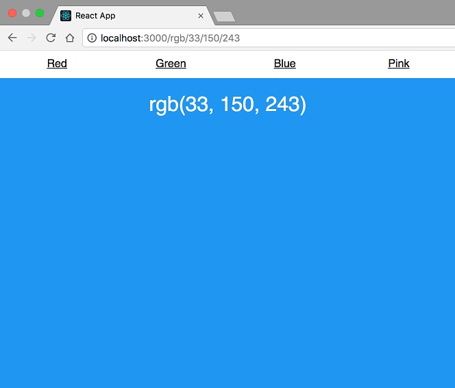
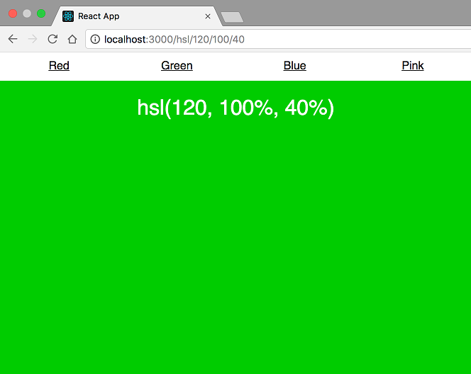

# React Router | 05 - A

## Animated Transitions with React Router

If you're reading this you've probably discovered that React Router doesn't
come with a solution for animated transitions out of the box. That ties
into React Router's philosophy - it gives you routing primitives that you
can build on and trusts you can figure out the rest. Because every app has
different needs, this approach is typically the safest. The downside of
this is that it'll take some extra work to get the exact functionality
you want. The tool we'll be using alongside React Router in this post is
“React Transition Group.” React Transition Group in an animation library
that gives us a way to perform animations when a React component enters
or leaves the DOM, which paired with React Router, is exactly what we
want.

Because there's a lot going on in this post, there's going to be some setup
we need to take before we ever even start talking about animations. Feel
free to skip ahead if you'd like.

First, let's walk through the type of app we're going to be building.
Animations aside, the goal is to make it so the user can go to `/hsl/:h/:s/:l`
or `/rgb/:r/:g/:b` and see the associated HSL or RGB color for those specific
values.

* **Example with an RGB color**



* **Example with an HSL color**



To do this, we'll rely heavily on React Router's "URL Parameters". If
you're not familiar with those, I recommend reading
[this post](https://tylermcginnis.com/react-router-url-parameters/)
before continuing.

By looking at the images above, we know we're going to need a few different
things before we even start looking at animated transitions.

1. An app skeleton
2. A navbar
3. A component to render when the path matches “/rgb/:r/:g/:b”
4. Another component to render when the path matches “/hsl/:h/:s/:l”
5. Some "Route"s which are going to render the components we create in
steps #4 and #5.

Let's start off tackling #1. We'll create a very basic component which
renders a Router and has some styles applied to the main `div` so the
background color will take up the whole view like seen in the example
images above. We'll use a very simple "CSS in JS" for our styles.

```
import React, { Component } from 'react'
import {
  BrowserRouter as Router,
  Link,
  Route, // for later
  Redirect, // for later
  Switch, // for later
} from 'react-router-dom'

class App extends Component {
  render() {
    return (
      <Router>
        <div style={styles.fill}>

        </div>
      </Router>
    )
  }
}

let styles = {}

styles.fill = {
  position: 'absolute',
  left: 0,
  right: 0,
  top: 0,
  bottom: 0
}
```

Cool. So our app really isn't doing anything yet. Next, let's move to the
navbar. It should be pretty straight forward. We'll have four Link
components linking us between Red (/hsl/10/90/50), Green
(/hsl/120/100/40), Blue (`/rgb/33/150/243`), and Pink
(`/rgb/240/98/146`).

```
class App extends Component {
  render() {
    return (
      <Router>
        <div style={styles.fill}>
          <ul style={styles.nav}>
            <NavLink to="/hsl/10/90/50">Red</NavLink>
            <NavLink to="/hsl/120/100/40">Green</NavLink>
            <NavLink to="/rgb/33/150/243">Blue</NavLink>
            <NavLink to="/rgb/240/98/146">Pink</NavLink>
          </ul>
        </div>
      </Router>
    )
  }
}

const NavLink = (props) => (
  <li style={styles.navItem}>
    <Link {...props} style={{ color: 'inherit' }}/>
  </li>
)

let styles = {}

styles.fill = {
  position: 'absolute',
  left: 0,
  right: 0,
  top: 0,
  bottom: 0
}

styles.nav = {
  padding: 0,
  margin: 0,
  position: 'absolute',
  top: 0,
  height: '40px',
  width: '100%',
  display: 'flex'
}

styles.navItem = {
  textAlign: 'center',
  flex: 1,
  listStyleType: 'none',
  padding: '10px'
}
```

Solid. Next up, we want to build a "component to render when the path
matches `/rgb/:r/:g/:b`". This is where the URL parameters will come into
play. Remember, this component will eventually be rendered when the path
matches `/rgb/:r/:g/:b`. What that means is it will be passed three
different url parameters, `r`, `g`, and `b`. We need to grab those values
and make their RGB value the background of the whole view.

```
...

const RGB = ({ match }) => {
  const { params } = match

  return (
    <div style={{
      ...styles.rgb,
      background: `rgb(${params.r}, ${params.g}, ${params.b})`
    }}>rgb({params.r}, {params.g}, {params.b})</div>
  )
}

...

styles.rgb  = {
  ...styles.fill,
  color: 'white',
  paddingTop: '20px',
  fontSize: '30px'
}
```

Next up, we need to do the exact same thing we just barely did with the
RGB component but this time, for a HSL component that matches
`/hsl/:h/:s/:l`.

```
...

const HSL = ({ match }) => {
  const { params } = match

  return (
    <div style={{
      ...styles.hsl,
      background: `hsl(${params.h}, ${params.s}%, ${params.l}%)`
    }}>hsl({params.h}, {params.s}%, {params.l}%)</div>
  )
}

...

styles.hsl  = {
  ...styles.fill,
  color: 'white',
  paddingTop: '20px',
  fontSize: '30px'
}
```

Now that we have our app skeleton, the navbar, the `RGB` and `HSL` components,
and some styling, the next thing we need to do is actually render some
`Route's so that when the path matches, the appropriate components will
get rendered. Because we're going to have a "catch all" route, we'll go
ahead and throw our Routes inside of a Switch component. (For more info
on "catch all" routes, visit
[Handling 404 pages (catch all routes) with React Router v4)](https://tylermcginnis.com/react-router-handling-404-pages/).

```
render() {
  return (
    <Router>
      <div style={styles.fill}>
        <ul style={styles.nav}>
          <NavLink to="/hsl/10/90/50">Red</NavLink>
          <NavLink to="/hsl/120/100/40">Green</NavLink>
          <NavLink to="/rgb/33/150/243">Blue</NavLink>
          <NavLink to="/rgb/240/98/146">Pink</NavLink>
        </ul>

        <div style={styles.content}>
          <Switch>
            <Route exact path="/hsl/:h/:s/:l" component={HSL} />
            <Route exact path="/rgb/:r/:g/:b" component={RGB} />
            <Route render={() => <div>Not Found</div>} />
          </Switch>
        </div>
      </div>
    </Router>
  )
}

...

styles.content = {
  ...styles.fill,
  top: '40px',
  textAlign: 'center'
}
```

Beautiful. At this point, using our navbar we can successfully navigate
between those four different routes. Our `HSL` and `RGB` components are
correctly parsing the `URL` parameters and the background we see is the
associated rgb/hsl color.

Before we finally get to animated transitions, there's one more addition
I want to make. Our app is currently structured so that we only have four
links, none of which are for an index `/` page. It's probably important to
handle that use case. Let's go ahead and redirect any users who try to
go to the index page to one of our hsl or rgb routes we already have set up.

```
render() {
  return (
    <Router>
      <div style={styles.fill}>
         <Route exact path="/" render={() => (
           <Redirect to="/hsl/10/90/50"/>
         )}/>

         ...
      </div>
    </Router>
  )
}
```

For more info on the Redirect component, visit
[Programmatically navigate with React Router](https://tylermcginnis.com/react-router-programmatically-navigate/).

Finaly! It's the moment you've been waiting for. Let's look at how to
animate the transitions between our routes.

The first thing we need to do is take a look into how React Transition
Group works. Like React Router, it has a component based API. The two
components we'll be using from it are `TransitionGroup` and `CSSTransition`.

First, let's look at `TransitionGroup`. The way you use `TransitionGroup`
is as a wrapper component.

```
<TransitionGroup>
  {/* stuff */}
</TransitionGroup>
```

Defined, it's a "state machine for managing the mounting and unmounting
of components over time". In practice, the first thing it does is it keeps
track of all of its children (`props.children`) inside of its local state.
Then, whenever its props change and its `componentWillReceiveProps` is called,
it loops over the next `children` and figures out which are new (entering),
which have been deleted (exiting), and which children have stayed the same.
Once its figured that out, it clones and merges all of its children together
passing to each item a few props which represent its status (exiting,
entering, etc). At this point it updates its local state with all of the
merged children (which all individually know if they're entering, exiting,
or remaining the same). That causes a re-render and the new merged `children`
are shown to the view.


