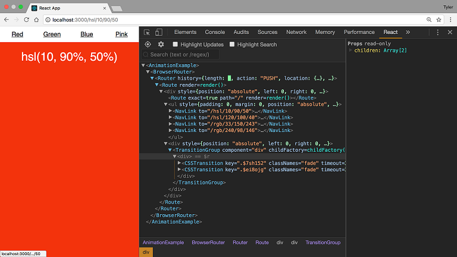
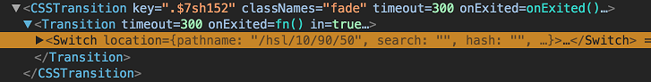
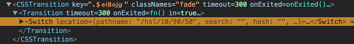

### Breathe

That was a lot of words to say that `TransitionGroup` renders all its new
and old children after passing certian props to each based on if  they're
new, old, or the same.

You may be wondering why it renders all the old children, new children,
and children that didn't change. The reason for that is for animation
purposes. For example, an "old" (`exiting`) child might receive an animation
that takes its opacity from 1 to 0. A new (`entering`) child might pull a
Peter Theil and receive an animation that takes its opacity from 0 to 1.
Regardless, it's important to understand that all the children are going
to be shown for a specified time.

The last important item to mention about `TransitionGroup` is the way in
which is keeps track of which children are which. If you're familiar with
React, you're familiar with the idea of `key` props. When you're mapping
over an array to create a list UI, you need to give each item a unique
`key` prop. This way, React can effectively manage that list. It's the exact
same thing with `TransitionGroup`'s children. Each child needs its own unique
`key` prop so `TransitionGroup` can more effectively figure out which
children have changed (entered or exited).

>   I realize we're pretty deep in the weeds here. Stick with me, you're
doing great

Next we have the `CSSTransition` component. When you render a `TransitionGroup`, its direct children must either be a `CSSTransition` component or a `Transition` component (both come with the library).

What `CSSTransition` does is it takes the information it got from `TransitionGroup`, specifically if certain children are entering, leaving, or staying the same, and it applies a pair of class names to them during the ?appear?, ?enter?, and ?exit? stages of the transition based on their status. What this allows you to do is, based on those class names, have CSS in your app which will select the same class names that `CSSTransition` is applying and add some styles to those elements. For example, if we told `CSSTransition` to apply a `fade` class, our CSS might look like this

```
.fade-enter {
  opacity: 0;
  z-index: 1;
}

.fade-enter.fade-enter-active {
  opacity: 1;
  transition: opacity 250ms ease-in;
}
```
That way we?ll adjust the opacity of an element anytime it has a class name of `fade-enter` (which `CSSTransition` will apply for us).

Alright now that we have our App set up and we understand a little bit more about React Transition Group, let?s join them.

First, we know that we have to wrap everything that?s going to be animating inside of `TransitionGroup`. Since we?ll be animating our Switch component, let?s wrap it in `TransitionGroup`.

```
...

import { TransitionGroup } from 'react-transition-group'

...

render() {
  return (
    <Router>
      <div style={styles.fill}>
         <Route exact path="/" render={() => (
           <Redirect to="/hsl/10/90/50"/>
         )}/>

        <ul style={styles.nav}>
          <NavLink to="/hsl/10/90/50">Red</NavLink>
          <NavLink to="/hsl/120/100/40">Green</NavLink>
          <NavLink to="/rgb/33/150/243">Blue</NavLink>
          <NavLink to="/rgb/240/98/146">Pink</NavLink>
        </ul>

        <div style={styles.content}>
          <TransitionGroup>
            <Switch>
              <Route exact path="/hsl/:h/:s/:l" component={HSL} />
              <Route exact path="/rgb/:r/:g/:b" component={RGB} />
              <Route render={() => <div>Not Found</div>} />
            </Switch>
          </TransitionGroup>
        </div>
      </div>
    </Router>
  )
}
```

Now as we talked about earlier, `TransitionGroup` only gets us part of the way there; we also need to tie in `CSSTransition`. Just like we did with `TransitionGroup`, let?s go ahead and wrap our Switch inside of a `CSSTransition` component so we can specify some properties for how Switch will be animated. We?ll pass it two props, `timeout` and `className`. `timeout` specifies how long TransitionGroup will display all of its `children` before removing the old `children` (aka how long the animation will take place). `className` is the className that is applied to the component as it enters or exits.

>   For example, if you provide a `className` of fade, then the following classes will be added to the component during its animation lifecycle - `fade-enter`, `fade-enter-active`, `fade-exit`, `fade-exit-active`, `fade-appear`, and `fade-appear-active`.

```
...

import { TransitionGroup, CSSTransition } from 'react-transition-group'

...

render() {
  return (
    <Router>
      <div style={styles.fill}>
         <Route exact path="/" render={() => (
           <Redirect to="/hsl/10/90/50"/>
         )}/>

        <ul style={styles.nav}>
          <NavLink to="/hsl/10/90/50">Red</NavLink>
          <NavLink to="/hsl/120/100/40">Green</NavLink>
          <NavLink to="/rgb/33/150/243">Blue</NavLink>
          <NavLink to="/rgb/240/98/146">Pink</NavLink>
        </ul>

        <div style={styles.content}>
          <TransitionGroup>
            <CSSTransition
              timeout={300}
              className='fade'
            >
              <Switch>
                <Route exact path="/hsl/:h/:s/:l" component={HSL} />
                <Route exact path="/rgb/:r/:g/:b" component={RGB} />
                <Route render={() => <div>Not Found</div>} />
              </Switch>
            </CSSTransition>
          </TransitionGroup>
        </div>
      </div>
    </Router>
  )
}
```

Now, because we?ve applied the `className` of `fade`, we need to add some
CSS that will do the animation for us. Wherever your CSS is located, add
the following CSS so we can animated the opacity.

```
.fade-enter {
  opacity: 0;
  z-index: 1;
}

.fade-enter.fade-enter-active {
  opacity: 1;
  transition: opacity 250ms ease-in;
}
```

And?! It doesn?t work.

Remember earlier when we talked about how `TransitionGroup` keeps track
of its children? Because we didn?t give `CSSTransition` a unique key,
whenever we switch routes, `TransitionGroup` just assumes nothing happened
since none of its children?s keys changed.

Now the question is, what should we use for a unique key? Well, what is
the thing that is changing in the app? It's the app's location. So ideally,
we would use that as the key since we know if the location changed, we'd
want `TransitionGroup` to be aware of that and let `CSSTransition` know. Now
we have another problem. How do we get the app's location? We could reach
out to `window.location` but that feels hacky since we're using React Router.
There are a few different ways to accomplish this with React Router. We
could use the `withRouter` HOC would would give us access to location as well
as the other router props (`history` and `match`). What we'll do in this
tutorial though is render a `Route` without a path and use a render prop.
Now that may seem weird, but if you render a `Route` without a path, that
route will always match and, like usual, the render prop will be passed
`location`, `match`, and `history`.

```
render() {
  return (
    <Router>
      <Route render={({ location }) => (
        <div style={styles.fill}>
           <Route exact path="/" render={() => (
             <Redirect to="/hsl/10/90/50"/>
           )}/>

          <ul style={styles.nav}>
            <NavLink to="/hsl/10/90/50">Red</NavLink>
            <NavLink to="/hsl/120/100/40">Green</NavLink>
            <NavLink to="/rgb/33/150/243">Blue</NavLink>
            <NavLink to="/rgb/240/98/146">Pink</NavLink>
          </ul>

          <div style={styles.content}>
            <TransitionGroup>
              <CSSTransition
                key={location.key}
                timeout={300}
                className='fade'
              >
                <Switch>
                  <Route exact path="/hsl/:h/:s/:l" component={HSL} />
                  <Route exact path="/rgb/:r/:g/:b" component={RGB} />
                  <Route render={() => <div>Not Found</div>} />
                </Switch>
              </CSSTransition>
            </TransitionGroup>
          </div>
        </div>
      )}/>
    </Router>
  )
}
```

now we have access to a unique key value in `location.key` and we pass
that as a key prop to `CSSTransition`. And with that, we?re done!

>   Just kidding

You?re so close! Pinky promise.

If you run the app as it currently is, you?ll notice that everything
seems to be working fine. When you navigate to a new link, for 300ms
(timeout), you see both the new `CSSTransition` component and the old
`CSSTransition` component. You can see this perfectly in the React
Devtools screenshot below.



>   This is the worst kind of bug. Both the problem and the solution
aren't obvious.

Here's what's happening. At that exact moment of the screenshot, if you
look deeper into the CSSTransition components, the first one looks like
this



and the second looks like this



Notice that eventually `CSSTransition` is rendering our `Switch` component.
That makes sense. You'll also notice that the images are the exact same
except for the key props. This isnt' good and it's the reason it's not
working.

Take a closer look at the `Switch` components in the images above. Notice
that both of them have the exact same location prop. We don't want that
to happen. Remember the purpose of `Switch` is to render the component of
the first `Route` that matches. If the location prop is the same on both
`Switch` components, that means that the same `Route` is going to match in
both `Switches` which means the same component is going to be rendered.
This means that even if the animations are occurring, we're not going to
see them since both components being rendered are the same. What we need
to do is figure out why the locations are the same, and how to fix them.
The goal here is to make it so when `TransitionGroup` renders its children,
the old child has the previous location while the new child has the new
location. Right now, they both just have the new location.

Whenever you render a `Switch` component, under the hood `Switch` is going
to get its location from `context.location`. You can think of it as `Router`
keeping track of the app's current location and `Switch` always has access
to it. This gives us a huge insight into the current issue we're having.
When both `Switches` are rendered, they're both grabbing the location from
context. By the time they render, `context.location` has already been
updated to the new location. This means that instead of getting one `Switch`
with the old location and one with the new location, both have the new
location since both got the location from `context.location`. Now, how do
we fix this?

When you use `Switch`, it takes in an optional location prop. Basically it
allows you to tell Switch "Hey, use this location instead of the location
from context". Exactly what we need. Since we already have access to
location from earlier when we wrapped all our code in a Route, all we have
to do is pass it so `Switch`.

```
<TransitionGroup>
  <CSSTransition
    key={location.key}
    timeout={300}
    className='fade'
  >
    <Switch location={location}>
      <Route exact path="/hsl/:h/:s/:l" component={HSL} />
      <Route exact path="/rgb/:r/:g/:b" component={RGB} />
      <Route render={() => <div>Not Found</div>} />
    </Switch>
  </CSSTransition>
</TransitionGroup>
```

And just like that, it works! (for real this time).

Here’s the full code.

```
import React, { Component } from 'react'
import { TransitionGroup, CSSTransition } from 'react-transition-group'
import {
  BrowserRouter as Router,
  Switch,
  Route,
  Link,
  Redirect
} from 'react-router-dom'

/* you'll need this CSS somewhere
.fade-enter {
  opacity: 0;
  z-index: 1;
}
.fade-enter.fade-enter-active {
  opacity: 1;
  transition: opacity 250ms ease-in;
}
*/

class App extends Component {
  render() {
    return (
      <Router>
        <Route render={({ location }) => (
          <div style={styles.fill}>
            <Route exact path="/" render={() => (
              <Redirect to="/hsl/10/90/50"/>
            )}/>

            <ul style={styles.nav}>
              <NavLink to="/hsl/10/90/50">Red</NavLink>
              <NavLink to="/hsl/120/100/40">Green</NavLink>
              <NavLink to="/rgb/33/150/243">Blue</NavLink>
              <NavLink to="/rgb/240/98/146">Pink</NavLink>
            </ul>

            <div style={styles.content}>
              <TransitionGroup>
                <CSSTransition
                  key={location.key}
                  classNames="fade"
                  timeout={300}
                >
                  <Switch location={location}>
                    <Route exact path="/hsl/:h/:s/:l" component={HSL} />
                    <Route exact path="/rgb/:r/:g/:b" component={RGB} />
                    <Route render={() => <div>Not Found</div>} />
                  </Switch>
                </CSSTransition>
              </TransitionGroup>
            </div>
          </div>
        )}/>
      </Router>
    )
  }
}

const NavLink = (props) => (
  <li style={styles.navItem}>
    <Link {...props} style={{ color: 'inherit' }}/>
  </li>
)

const HSL = ({ match }) => {
  const { params } = match

  return (
    <div style={{
      ...styles.fill,
      ...styles.hsl,
      background: `hsl(${params.h}, ${params.s}%, ${params.l}%)`
    }}>hsl({params.h}, {params.s}%, {params.l}%)</div>
  )
}

const RGB = ({ match }) => {
  const { params } = match

  return (
    <div style={{
      ...styles.fill,
      ...styles.rgb,
      background: `rgb(${params.r}, ${params.g}, ${params.b})`
    }}>rgb({params.r}, {params.g}, {params.b})</div>
  )
}

const styles = {}

styles.fill = {
  position: 'absolute',
  left: 0,
  right: 0,
  top: 0,
  bottom: 0
}

styles.content = {
  ...styles.fill,
  top: '40px',
  textAlign: 'center'
}

styles.nav = {
  padding: 0,
  margin: 0,
  position: 'absolute',
  top: 0,
  height: '40px',
  width: '100%',
  display: 'flex'
}

styles.navItem = {
  textAlign: 'center',
  flex: 1,
  listStyleType: 'none',
  padding: '10px'
}

styles.hsl  = {
  ...styles.fill,
  color: 'white',
  paddingTop: '20px',
  fontSize: '30px'
}

styles.rgb  = {
  ...styles.fill,
  color: 'white',
  paddingTop: '20px',
  fontSize: '30px'
}

export default App
```

The goal of this post was to really dive into the why of animated
transitions in React Router.

**tl;dr:** Wrap your Switch component inside of both `TransitionGroup` and
`CSSTransition`, pass the location's key to `CSSTransition` and pass the
`location` to `Switch`.
