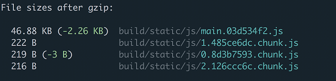

# React Router | 06

## Code Splitting with React Router

It's 2018. Your users shouldn't have to download your entire app when
all they need is a piece of it. If a user is creating a new post, it
doesn't make sense to have them download all the code for the
Registration view. If a user is registering, they don't need the huge
rich text editor your app needs on the Settings view. It's wasteful
and some would argue disrespectful to those users who don't have the
privilege of unlimited bandwidth. This idea has not only gained much
more popularity in recent years, but it's also become exponentially
easier to pull off - it even has a fancy cool name - code splitting.

The idea is simple, don't download code until the user needs it. In
practice, it can be a little more complicated. The reason for this isn't
because code splitting itself is terribly difficult, but that there are
various tools to do it and everyone has an opinion on which is the best.
When you're first starting out, it can be hard to parse what is what.

>   The two most common approaches are using Webpack and its
[bundle loader](https://github.com/webpack-contrib/bundle-loader) or the
ECMAScript dynamic `import()` proposal which is currently
[stage 3](https://tylermcginnis.com/videos/ecmascript/).
Any chance I get to not use webpack, I take, so we'll be using dynamic
`import()` in this post.

If you're familiar with ES modules, you know that they're completely
static. What that means is that you must specific what you're importing
and exporting at compile time, not run time. This also means that you
can't dynamically import a module based on some condition. imports need
to be declared at the top of your file or they'll throw an error.

```
if (!user) {
  import * as api from './api' // "import' and 'export' may only appear at the top level"
}
```

Now, what if `import` didn't have to be static? Meaning what if the code
above worked? What benefits would that give us? First it would mean we
could load certain modules on demand. That would be pretty powerful
since it would enable us to get closer to the vision of only downloading
code the user needs.

```
if (editPost === true) {
  import * as edit from './editpost'

  edit.showEdtior()
}
```

Assuming `editpost` contained a pretty large rich text editor, we'd make
sure we didn't download it until the user was actually ready to use it.

>   Another cool use case of this would be for legacy support. You could
hold off on downloading certain code until you were certain the user's
browser didn't already have it natively.

Here's the good news (that I kind of already alluded to earlier). This
type of functionality does exist, it's supported by Create React App,
and it's currently in Stage 3 of the ECMAScript process. The difference
is that instead of using `import` as you typically would, you use it like
a function that returns you a promise that resolves with the module once
the module is completely loaded.

``` 
if (editPost === true) {
  import('./editpost')
    .then((module) => module.showEditor())
    .catch((e) => )
}
```

Pretty rad, right?

Now that we know how to dynamically import modules, the next step is
figuring out how to use it with React and React Router.

The first (and probably biggest) question we need to ask ourselves when
it comes to code splitting with React is where should we split at?
Typically, there are two answers.

>   Split at the route level.
>   Split at the component level.

The more common approach is to split at the route level. You already split
your app into different routes, so adding in code splitting on top of
that feels pretty natural. How would this actually look?
 
Let's start off with a basic React Router example. We'll have three
routes, `/, /topics, /settings`

```
import React, { Component } from 'react'
import {
  BrowserRouter as Router,
  Route,
  Link,
} from 'react-router-dom'

import Home from './Home'
import Topics from './Topics'
import Settings from './Settings'

class App extends Component {
  render() {
    return (
      <Router>
        <div>
          <ul>
            <li><Link to='/'>Home</Link></li>
            <li><Link to='/topics'>Topics</Link></li>
            <li><Link to='/settings'>Settings</Link></li>
          </ul>

          <hr />

          <Route exact path='/' component={Home} />
          <Route path='/topics' component={Topics} />
          <Route path='/settings' component={Settings} />
        </div>
      </Router>
    )
  }
}

export default App
```

Now, say our `/settings` route was super heavy. It contains a rich text
editor, an original copy of Super Mario Brothers, and an HD image of Guy
Fieri. We don't want the user to have to download all of that when
they're not on the `/settings` route. Let's use our knowledge of dynamic
imports and React to code split the `/settings` route.

Just like we solve any problem in React, let's make a component. We'll
call it `DynamicImport`. The goal of `DynamicImport` is to dynamically load
a module, then, once it's loaded, to pass that module to its `children`.

```
const Settings = (props) => (
  <DynamicImport load={() => import('./Settings')}>
    {(Component) => Component === null
      ? <Loading />
      : <Component {...props} />}
  </DynamicImport>
)
```

The above code tells us two important details about `DynamicImport`.
First, it will receive a `load` prop which when invoked, will dynamically
import a module using the dynamic import syntax we covered earlier.
Second, it will receive a function as its `children` which will need to be
invoked with the imported module.

Before we dive into the implementation of `DynamicImport`, let's think
about how we might accomplish this. The first thing we need to do is to
make sure we call `props.load`. That will return us a `promise` that when it
resolves, should have the module. Then, once we have the module, we need
a way to cause a re-render so we can invoke `props.children` passing it
that module. How do you cause a `re-render` in React? By setting state. By
adding the dynamically imported module to `DynamicImports` local state, we
follow the exact same process with React as we're used to -
`fetch data -> set state -> re-render`. Except this time instead of "fetch
data", we have "import module".

First, let's add some initial state to `DynamicImport`. `component` will
eventually be the component that we're dynamically importing.

```
class DynamicImport extends Component {
  state = {
    component: null
  }
}
```

Now, we need to call `props.load`. That will return us a `promise` that
when it resolves, should have the module.

```
class DynamicImport extends Component {
  state = {
    component: null
  }
  componentDidMount () {
    this.props.load()
      .then((component) => {
        this.setState(() => ({
          component
        }))
      })
  }
}
```

There's one small gotcha here. If the module we're dynamically importing
is using ES modules (`export default`), it'll have a .default property.
If the module is using commonjs (module.exports), it won't. Let's change
our code to adapt for that.

```
this.props.load()
  .then((component) => {
    this.setState(() => ({
      component: component.default ? component.default : component
    }))
  })

Now that we're dynamically importing the module and adding it to our state, the last thing we need to do it figure out what the render method looks like. If you'll remember, when the DynamicImport component is used, it'll look like this 
const Settings = (props) => (
  <DynamicImport load={() => import('./Settings')}>
    {(Component) => Component === null
      ? <Loading />
      : <Component {...props} />}
  </DynamicImport>
)

Notice that we're passing it a function as it's children prop. That means we need to invoke children passing is the component state. 
class DynamicImport extends Component {
  state = {
    component: null
  }
  componentDidMount () {
    this.props.load()
      .then((component) => {
        this.setState(() => ({
          component: component.default ? component.default : component
        }))
      })
  }
  render() {
    return this.props.children(this.state.component)
  }
}
```

Solid. Now anytime we want to dynamically import a module, we can wrap
it in `DynamicImport`. If we were to do this to all our routes, our code
would look like this.

```
import React, { Component } from 'react'
import {
  BrowserRouter as Router,
  Route,
  Link,
} from 'react-router-dom'
 
class DynamicImport extends Component {
  state = {
    component: null
  }
  componentDidMount () {
    this.props.load()
      .then((component) => {
        this.setState(() => ({
          component: component.default ? component.default : component
        }))
      })
  }
  render() {
    return this.props.children(this.state.component)
  }
}
const Home = (props) => (
  <DynamicImport load={() => import('./Home')}>
    {(Component) => Component === null
      ? <p>Loading</p>
      : <Component {...props} />}
  </DynamicImport>
)
 
const Topics = (props) => (
  <DynamicImport load={() => import('./Topics')}>
    {(Component) => Component === null
      ? <p>Loading</p>
      : <Component {...props} />}
  </DynamicImport>
)
 
const Settings = (props) => (
  <DynamicImport load={() => import('./Settings')}>
    {(Component) => Component === null
      ? <p>Loading</p>
      : <Component {...props} />}
  </DynamicImport>
)
 
class App extends Component {
  render() {
    return (
      <Router>
        <div>
          <ul>
            <li><Link to='/'>Home</Link></li>
            <li><Link to='/topics'>Topics</Link></li>
            <li><Link to='/settings'>Settings</Link></li>
          </ul>
          <hr />
          <Route exact path='/' component={Home} />
          <Route path='/topics' component={Topics} />
          <Route path='/settings' component={Settings} />
        </div>
      </Router>
    )
  }
}
 
export default App
```

How we do we know this is actually working and code splitting our routes?
If you run npm run build with an app created by Create React App, you'll
see our app's been split.



Each chunk is each dynamic import() in our app.
 
You made it this far. Dance break

Remember earlier when we talked about how there were two main ways to go about code splitting your app? We had this handy little guide.
 
>    1. Split at the route level.
>    2. Split at the component level.

So far we've only covered splitting at the route level. This is where a
lot of people stop. Code splitting at the route level only is like
brushing your teeth but never flossing. Your teeth will be mostly clean,
but you'll still get cavities.

Instead of thinking about code splitting as splitting your app up by its
routes, you should think of it as splitting your app up by its components
(`<Route>`s are just components, after all). If you have a rich text
editor that lives in a modal, splitting by the route only will still
load the editor even if the modal is never opened.

At this point it's more of a paradigm shift that needs to happen in your
brain rather than any new knowledge. You already know how to dynamically
import modules with `import()`, now you just need to figure out which
components in your app you can hold off downloading until your user needs
them.

>   It would be dumb of me to end this post without mentioning
[React Loadable](https://github.com/thejameskyle/react-loadable). It's
a "higher order component for loading components with
dynamic imports". Essentially what it does is it takes everything we
talked about in this post, and wraps it up into one nice little API.
It even handles a bunch of edge cases we didn't cover like error
handling and server side rendering. Check it out if you want a simple,
out of the box solution to code splitting.
